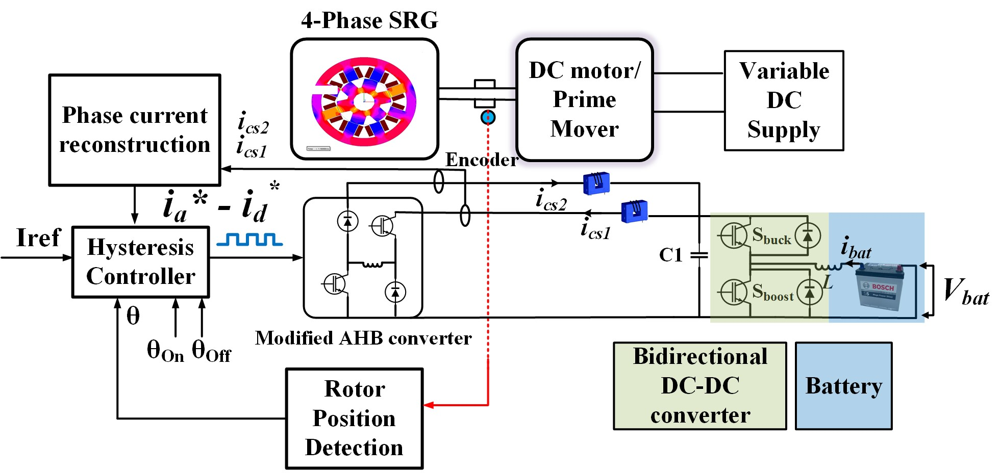
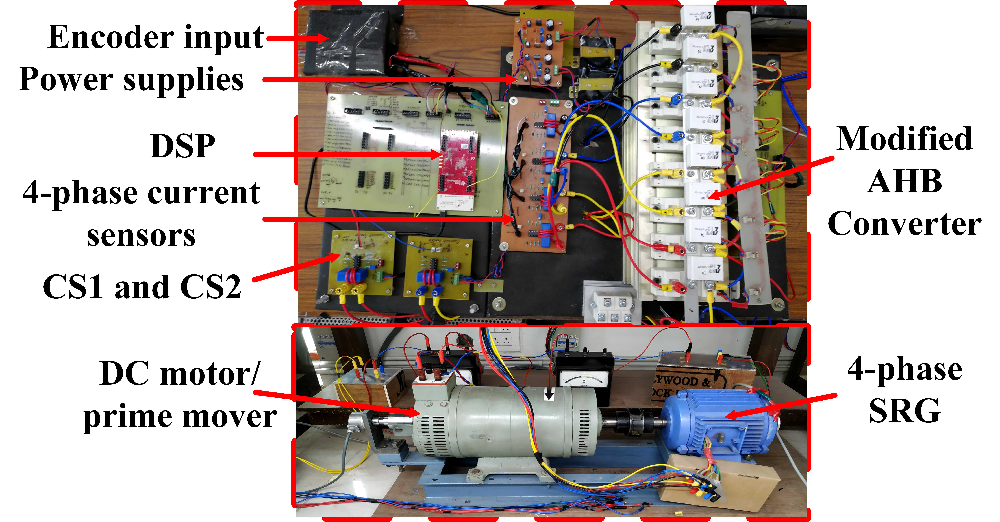

# Basic Information
---

```
Professional Experience
```
- Carrier Technologies India Limited

| Position       |                   |       |
|:---------------|:------------------|:------|
| Lead Engineer  |                   | 03/2024--Present|
| Senior Engineer|                   | 09/2022--03/2024|

```
Education [Persuing]
```

| Degree                               |Institute                                                    |Year       |
|:-------------------------------------|:------------------------------------------------------------|:----------|
| Master of Science                    |Liverpool John Moores University, Liverpool, United Kingdom      |                 |
| Executive Post Graduation Programme  |International Institute of Information Technology, Bangalore, India | 09/2022--Present|

```
Education
```

| Degree                           |Institute                                |Year       |
|:---------------------------------|:----------------------------------------|:----------|
| Doctor of Philosophy   (Ph.D.)   |Indian Institute of Technology, Rupnagar, India| 07/2018--09/2022|
| Masters of Technology  (M.Tech)  |Amrita Vishwa Vidhyapeetham, Coimbatore, India  | 07/2016--07/2018|
| Bachelor of Technology (B.E)     |SVVV Indore, Affiliated to RGPV, Bhopal, India  | 07/2011--07/2015|


```
 Research Publications
 ```

- **Peer Reviewed Accepted And In-Press IEEE Transactions/Journals**

1.	**V. Shah** and S. Payami, "An Integrated Driving/Charging 4-Phase Switched Reluctance Motor Drive with Reduced Current Sensors for Electric Vehicle Application," in IEEE Journal of Emerging and Selected Topics in Power Electronics, doi: 10.1109/JESTPE.2021.3120468.|
[<a href="https://ieeexplore.ieee.org/document/9576067">IEEE link</a>]
2.	**V. Shah** and S. Payami, "Fully Integrated Multi-Level Power Converter for SRM Drive with Charging Capabilities (G2V) for Electric Vehicle Application," in IEEE Journal of Emerging and Selected Topics in Industrial Electronics, 2022, doi: 10.1109/JESTIE.2022.3190794.
[<a href="https://ieeexplore.ieee.org/document/9829279">[IEEE link</a>] 
3.	**V. Shah**, G. Kumawat and S. Payami, "Phase Current Reconstruction Technique for 4-Phase Switched Reluctance Generator with Two Current Sensors," in IEEE Journal of Emerging and Selected Topics in Power Electronics, 2022, doi: 10.1109/JESTPE.2022.3217693.
<a href="https://ieeexplore.ieee.org/document/9931169">[IEEE link</a>]
4.	**V. Shah** and S. Payami, "Integrated Converter with G2V, V2G, and DC/V2V Charging Capabilities for Switched Reluctance Motor Drive-Train Based EV Application," in IEEE Transactions on Industry Applications, doi: 10.1109/TIA.2023.3242636.
<a href="https://ieeexplore.ieee.org/document/10038541">[IEEE link</a>]
5.	**V. Shah** and S. Payami, “Switched Reluctance Motor Drive-train with Fully Integrated Battery Charger and Instantaneous Zero Charging Torque for Electric Transportation” in IEEE Transactions on Electrified Transportation, doi: 10.1109/TTE.2023.3308893.
<a href="https://ieeexplore.ieee.org/abstract/document/10234554">[IEEE link</a>]

- **Peer Reviewed Conferences And In-Press**

6.	**V. Shah**, M. Alam and S. Payami, "High Torque/Ampere Direct Torque Control of Switched Reluctance Motor Drives," 2019 National Power Electronics Conference (NPEC), 2019, pp. 1-6, doi: 10.1109/NPEC47332.2019.9034777. 
7.	**V. Shah**, M. Alam and S. Payami, "A Novel Direct Torque Control Scheme for High-Speed Control of Switched Reluctance Motor Using 4-Level Torque Controller," The 10th International Conference on Power Electronics, Machines and Drives (PEMD 2020), 2020, pp. 966-971, doi: 10.1049/icp.2021.0974
8.	M. Alam, **V. Shah** and S. Payami, "ONLINE FAULT DIAGNOSIS OF STATIC AND DYNAMIC ECCENTRICITY IN SWITCHED RELUCTANCE MOTORS USING PARKS VECTOR ALGORITHM," The 10th International Conference on Power Electronics, Machines and Drives (PEMD 2020), Online Conference, 2020, pp. 885-889, doi: 10.1049/icp.2021.1055.
9.	**V. Shah** and S. Payami, "A Novel Direct Torque Control for 4-Phase Switched Reluctance Motor Considering the Actual Rotor Pole Arc with High Torque/Ampere Ratio," IECON 2020 The 46th Annual Conference of the IEEE Industrial Electronics Society, 2020, pp. 826-831, doi: 10.1109/IECON43393.2020.9254741.
10.	**V. Shah** and S. Payami, "A Novel 4-level Converter with Inherent Voltage Boosting for 4-Phase SRM," 2020 IEEE International Conference on Power Electronics, Drives and Energy Systems (PEDES), 2020, pp. 1-6, doi: 10.1109/PEDES49360.2020.9379535.
11.	**V. Shah** and S. Payami, "Integrated Power Converter with G2V and V2G capabilities for 4-Phase SRM Drive Based EV Application," 2021 IEEE 2nd International Conference on Smart Technologies for Power, Energy and Control (STPEC), 2021, pp. 1-6, doi: 10.1109/STPEC52385.2021.9718718. 
12.	**V. Shah** G. Kumawat and S. Payami, "Integrated Power Converter with G2V, V2G and Direct V2V Capabilities for SRM Drive Based Electric Vehicle Application," 2022 Second International Conference on Power, Control and Computing Technologies (ICPC2T), 2022, pp. 1-6, doi: 10.1109/ICPC2T53885.2022.9776689.
13.	**V. Shah**, G. Kumawat and S. Payami, "An Integrated Charger with High Efficiency Over Wide Range of Input Voltage with G2V, V2G, and Direct V2V capabilities for SRM Drive," 2022 IEEE IAS Global Conference on Emerging Technologies (GlobConET), 2022, pp. 12-17, doi: 10.1109/GlobConET53749.2022.9872370.
14.	**V. Shah** and S. Payami, "A Multi-Level Converter for SRM Drive Based EV Applications with Auxiliary Load Driving Capability," 2022 IEEE 2nd International Conference on Sustainable Energy and Future Electric Transportation (SeFeT), 2022, pp. 1-6, doi: 10.1109/SeFeT55524.2022.9909185.
15.	**V. Shah**, G. Kumawat and S. Payami “Solar Powered Electric Drive-Train With Integrated Bidirectional DC/V2V Fast Charger Incorporating Switched Reluctance Motor” 2022 IEEE GLOBAL CONFERENCE ON COMPUTING, POWER AND COMMUNICATION TECHNOLOGIES (GlobConPT).
16.	**V. Shah**, G. Kumawat and S. Payami, "Solar Powered Electric Drive-Train With Integrated Multifunctional Dual Power On-Board Charger Incorporating N-phase SRM," 2022 IEEE International Conference on Power Electronics, Drives and Energy Systems (PEDES), Jaipur, India, 2022, pp. 1-5, doi: 10.1109/PEDES56012.2022.10080481.
17.	G. Kumawat, **V. Shah** and S. Payami, "A Universal-Input On-Board Charger Integrated Converter for SRM Drive Targeting Electric Vehicle Application," 2022 IEEE International Conference on Power Electronics, Drives and Energy Systems (PEDES), Jaipur, India, 2022, pp. 1-5, doi: 10.1109/PEDES56012.2022.10080831.
18.	G. Kumawat, **V. Shah** and S. Payami, "Analytical Method for Optimal Control of Switched Reluctance Generator," 2022 IEEE 10th Power India International Conference (PIICON), New Delhi, India, 2022, pp. 1-6, doi: 10.1109/PIICON56320.2022.10045169.
19.	**V. Shah** and A. Vijayakumari, "Field Oriented Control of Surface Mount Permanent Magnet Synchronous Machine with Non Linear Observer for Continuous Rotor Position Estimation," 2018 3rd International Conference for Convergence in Technology (I2CT), Pune, India, 2018, pp. 1-6, doi: 10.1109/I2CT.2018.8529529.
20.	**V. Shah** and A. Vijayakumari, "Regression based-programmable optimal controller for induction machine," 2017 International Conference on Technological Advancements in Power and Energy ( TAP Energy), Kollam, India, 2017, pp. 1-6, doi: 10.1109/TAPENERGY.2017.8397278.
21.	**V. Shah** and K. Prakash N., "FPGA Implementation of Sensorless Field Oriented Current Control of Induction Machine," 2017 IEEE International Conference on Computational Intelligence and Computing Research (ICCIC), Coimbatore, India, 2017, pp. 1-5, doi: 10.1109/ICCIC.2017.8524311

```
Project-1
```
Abstract-- The paper proposes a novel current reconstruction technique with two current sensors to reconstruct the phase currents in a 4-phase switched reluctance generator (SRG). Conventionally with the asymmetric half-bridge converter (AHB), four current sensors are employed, one in each phase for measuring the phase currents in SRG. In the proposed work, the AHB converter's DC bus is split into the excitation bus and the generating bus. Two current sensors are employed, first in the excitation bus, measuring the energization current of the respective active phase during phase excitation. And the second current sensor is placed in the generating bus, measuring the generating current. The switching functions of the AHB converter are re-designed such that the phase current during free-wheeling and de-energization flows through the generating bus. The proposed current reconstruction technique using linear algebraic equations facilitates the reconstruction of phase currents from two current sensors only. This is the first time a paper experimentally verifies the proposed phase current reconstruction technique for 4-phase SRG, wherein multiple phases are conducting simultaneously. Also, during power electronics switch fault the proposed current reconstruction method successfully reconstructs healthy phase currents after isolating the faulty phase. 
---
<center></center>
---
---
<center></center>
---
